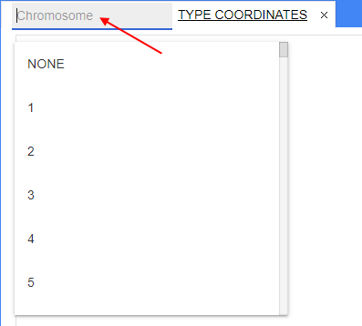
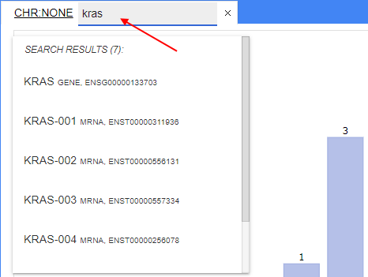
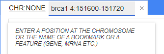
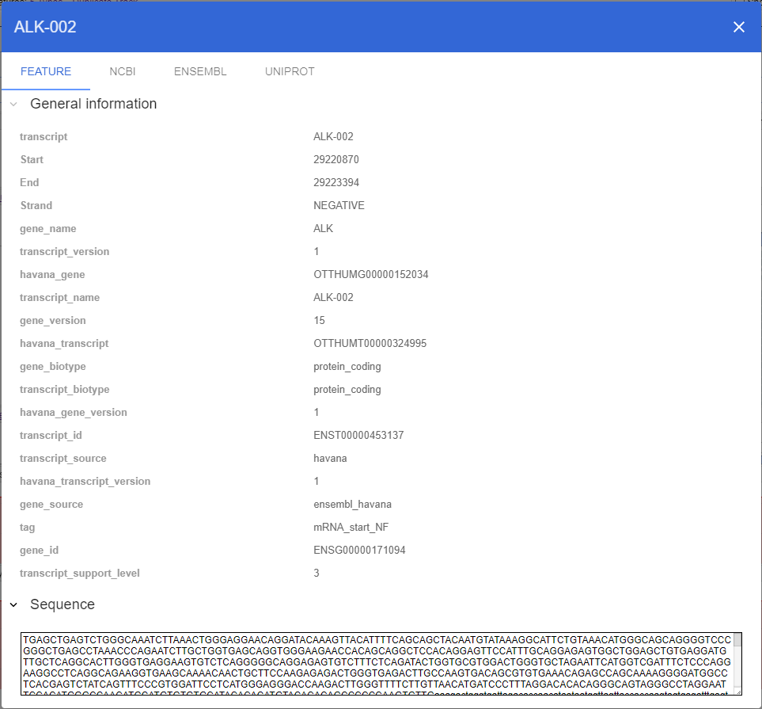
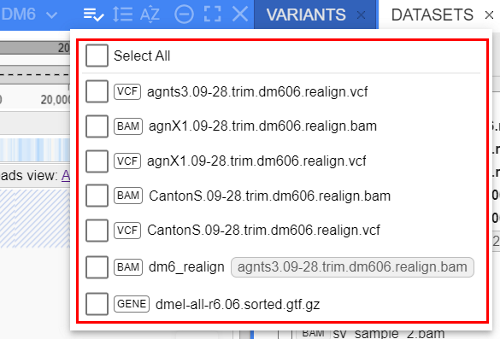
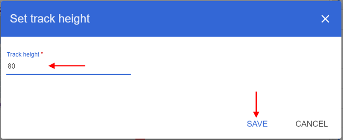

# Tracks

- [Navigating to a specific genome location](#navigating-to-a-specific-genome-location)
    - [Using the ruler](#using-the-ruler)
    - [Using zoom in/out buttons](#using-zoom-inout-buttons)
    - [Using click-to-zoom](#using-click-to-zoom)
    - [Using scrolling on a track](#using-scrolling-on-a-track)
    - [Using unified coordinates and search control](#using-unified-coordinates-and-search-control)
        - [Split view](#split-view)
    - [Viewing features info](#viewing-features-info)
- [Tracks selection](#tracks-selection)
- [Tracks renaming](#tracks-renaming)
- [General control](#general-control)
    - [Resize tracks height](#resize-tracks-height)
    - [Customize the font size of track label](#customize-the-font-size-of-track-label)
    - [Download original file](#download-original-file)

## Navigating to a specific genome location

### Using the ruler

You can use the ruler to navigate inside a chromosome:  
  

The ruler has two components:

- The **global ruler** always depicts the whole chromosome scale. The indicator shows the current position. To move a position, click and drag the icon in the middle of the range. To change the range's size, click and drag the indicator's edge(s):  
  
- The **local ruler** depicts the range selected on the global ruler. Click and drag on the range to zoom in on it. A coordinate inside a blue bubble shows current position (that is in the center of the screen):  
  

### Using zoom in/out buttons

To zoom in or out on tracks, you can use **+/-** buttons located in the upper right corner of the track view. The **+/-** buttons are transparent by default and become opaque when you hover over them:  
  

### Using click-to-zoom

To zoom in on a specific location, double click (with a left mouse button) any place on a track.
This will zoom browser by one level (like clicking "**+**" button in the Zoom menu) and will place clicked coordinate to the center of the screen.

### Using scrolling on a track

When viewing a track, you can also use **Shift + mouse wheel scroll** to zoom in or out on that track.

### Using unified coordinates and search control

**Browser** panel tab's header contains **unified coordinates and search control** which consists of 2 user inputs:

- Chromosome selector dropdown at left of tab's header
- Coordinates and search input control at right of tab's header  
    
  

To navigate to a region of interest, one of the following steps should be performed:

- Select a chromosome from the chromosome selector dropdown to open the whole chromosome scale in the Browser panel:  
  
- Type a chromosome's name and position of interest in a coordinates and search input control and press Enter on your keyboard to open a particular position. Supported formats of inputs are:
    - `COORDINATE` e.g. "_29225485_" - the location will be opened on the current chromosome and have the specified coordinate as central position
    - `START-END` e.g. "_29223634-29225485_" - the location will be opened on the current chromosome and have the specified coordinates as location boundaries
    - `CHROMOSOME:COORDINATE` e.g. "_1:29223634_" - the location will be opened on the specified chromosome and have the specified coordinate as central position
    - `CHROMOSOME:START-END` e.g. "_3:29223634-29225485_" - the location will be opened on the specified chromosome and have the specified coordinates as location boundaries  
    
- Type a gene, transcript, feature or bookmarks name in a coordinates and search input control. Search results will be displayed at the list. To navigate to the region of a particular feature, click a corresponding search result item or press Enter key to navigate to the first item from the search results list:  
  

#### Split view

Users can also split browser for any location of interest - via the unified coordinates and search control.

For that, specify two sets of coordinates (separated by space) to the unified coordinates and search control, and confirm the input by press the Enter key.  
After that, the **Browser** pane will be splitted to two panes:

- in the main (left) pane, the first specified location will be displayed
- in the second (right) pane, the second location will be displayed

Example:

- specify two sets of coordinates to the unified coordinates and search control, e.g.:  
  
- press Enter key, the **Browser** pane will be splitted according to specified locations:  
  

Locations should be separated by any count of spaces.  
Only two locations can be specified simultaneously. User doesn't have the ability to split an additional browser pane or navigate to other location in the additional browser pane using its unified coordinates and search control.

The following formats for each location are supported:

- `COORDINATE` e.g. "_29225485_" - the location will be opened on the current chromosome and have the specified coordinate as central position
- `START-END` e.g. "_29223634-29225485_" - the location will be opened on the current chromosome and have the specified coordinates as location boundaries
- `CHROMOSOME:COORDINATE` e.g. "_1:29223634_" - the location will be opened on the specified chromosome and have the specified coordinate as central position
- `CHROMOSOME:START-END` e.g. "_3:29223634-29225485_" - the location will be opened on the specified chromosome and have the specified coordinates as location boundaries  
- `FEATURE` e.g. "_kras_" - a gene, transcript, feature name. Will be opened the first location from search results list for the specified feature

Example of the splitting for the locations set "_brca1 4:151600-151720_":  
    
  

### Viewing features info

There are two ways to view features for any track that contains them:

- **Hovering tooltip** - by default, when hovering over a feature on the track, a tooltip with the feature info appears:  
    
  To disable this feature, click the **Settings** button in the top right corner of the window, open **General** menu, and untick the option **Display tooltips**. When **Display tooltips** is disabled, **Display tooltips for alignments coverage** could be managed optionally.  
  
- **Modal popup window** - to show feature info in a popup window (e.g. when tooltips are turned off), click the feature on the track and select **Show info** in the context menu:  
    
  The popup window will contain the same information as the tooltip plus the nucleotide sequence of the feature:  
  

## Tracks selection

NGB supports the selection of multiple tracks to perform certain group actions (applicable to the selected track types).

Tracks selection can be performed:

- via the checkbox for each track (near the track type):  
  
- or via the special "**Selection**" menu in the browser header:
    - Click the corresponding button:  
    
    - Select desired tracks from the list:  
    

User can select one/several/all tracks (regardless their types).  
When at least 2 tracks are selected, on the top of tracks area, the additional floating menu appears - where group actions can be applied to the selected tracks:  
  

This menu contains, at least:

- label with the count of selected tracks
- **Select all** button - to select all displaying tracks in the Browser
- **Clear** button - to clear tracks selection and close the floating menu
- **General** sub-menu - the common list of configurations/actions that can be applied to all selected tracks:  
    
    - **Resize** item allows to change the tracks' height in pixels (for details see [here](#resize-tracks-height))
    - **Font size** item allows to change the track names' font size (for details see [here](#customize-the-font-size-of-track-label))

Also, if the only tracks of the same type are selected, there will be additional sub-menu(s) with corresponding type-specific configurations/actions in this floating menu. E.g., for [`WIG`](tracks-wig.md) tracks:  
  

**_Note_**: if the only tracks of the same type are selected, **General** sub-menu can have more items than only _Resize_ and _Font size_ - according to the specific track type.

If any action is selected in the described floating menu - it will automatically being applied to the corresponding group of tracks.

## Tracks renaming

User can rename any track in the browser.

For that:

1. Click the file name near the track type, e.g.:  
  
2. In the appeared field, specify a new track name you wish, e.g.:  
    
  
3. Press the _Enter_ key once the new name will be specified.
4. New specified name will be displayed for the current track:  
  

After the track is renamed, you can see the new name and the original one near it:

- at the track header:  
  
- in the **Datasets** panel:  
  
- in the **Selection** menu:  
  

The behavior (whether to show the original name) is being controlled via separate global NGB setting:  
  

**_Note_**: once the track is renamed - the new name will be stored in the session. So the next time the track is loaded – the settings are restored.

## General control

**General** sub-menu contains several items with actions that user can perform with a track.  
The list of these actions can differ according to the specific track type.  
But all tracks contain at least the following items (full description see below):

- _Resize_ - to resize a track height
- _Font size_ - to change a track header font size
- _Download_ - to download an original track file

### Resize tracks height

NGB allows to change the tracks height individually using the “drag-and-drop” method.  

Also, the track height size can be set manually in pixels.  
For that:

1. Click the **General** control in the track header:  
  
2. In the appeared list, click the **Resize** item:  
  
3. In the popup, specify the height of the track in pixels and confirm, e.g.:  
  
4. The track will be resized according to the set height:  
  
5. If you wish to set the same height for all tracks in the browser - return at step 3 and set the "**Apply to all tracks**" checkbox:  
  
6. If you wish to set the same height for all tracks of that type in the browser - return at step 3 and set the "**Apply to all {track_type} tracks**" checkbox:  
  

Also, you can manage the height for a group of selected tracks. For that, use the **General** -> **Resize** items in the [floating menu](#tracks-selection) of selected tracks:  
    
In such case, the set height will be applied only to selected tracks:  
  

### Customize the font size of track label

Users have the ability to change the font size of track labels (individually or multiple at a time).

For that:

1. Click the **General** control in the track header:  
  
2. In the appeared list, click the **Font size** item:  
  
3. In the popup, specify the font size (in `px`) for the track label and confirm, e.g.:  
  
4. The track label font size will be changed according to the set value:  
  
5. If you wish to set the same font size for all track labels in the browser - return at step 3 and set the "**Apply to all tracks**" checkbox.
6. If you wish to set the same font size for all track labels of that type in the browser - return at step 3 and set the "**Apply to all {track_type} tracks**" checkbox.

Also, you can manage the label font size for a group of selected tracks. For that, use the **General** -> **Font size** items in the [floating menu](#tracks-selection) of selected tracks:  
    
In such case, the set height will be applied only to selected tracks:  
  

### Download original file

Users have the ability to download an original file that was loaded for the track.
For that:

1. Click the **General** control in the track header:  
  
2. In the appeared list, click the **Download file** item:  
  
3. Download will start automatically:  
  
