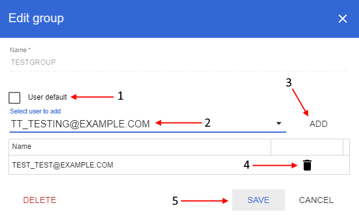

# Groups

> **_Note_**: user management panel is available only for the users with the *ADMIN* role.

In user management panel select "**Groups**" tab:  
    

On this tab you can view the full NGB users' groups list (only *internal groups*, not *domain*). Here you can add a new group or delete existing, also you can assign groups to the users.

You can search specific group or limit displayed list by typing group name in the query string in the upper side of the tab.

## Add new group

To add a new group click "**Create group**" button on the right side of the panel.

In opened pop-up window: input a group name into the "**Name**" field (**1**), if you want to appoint the creating group to every new user by default set "**User default**" checkbox (**2**), if you want to assign specific user(s) to the creating group - select them from the dropdown list (**3**) and click "**Add**" button to confirm (**4**). Then click "**Create**" button (**5**) to finish adding a new group:  
    

After that created group will be appeared in the NGB groups list:  
    

> You also could create this group and add existing users from the example above into it through CLI using the command:  
> `$ ngb reg_group testgroup -u tt_testing@example.com,test_test@example.com`

## Edit group

To edit a group click  icon opposite the group name.

In opened pop-up window: if you want to appoint the group to every new user by default set "**User default**" checkbox (**1**), if you want to to assign specific user(s) to the group - select them from the dropdown list (**2**) and click "**Add**" button to confirm (**3**), if you want to exclude specific user(s) from the group click "**Recycle bin**" button opposite user name (account) (**4**). After all changes have been made click "**Save**" button (**5**) to confirm:  
    

> You also can add existing users from the example above to this group through CLI using the command:  
> `$ ngb add_group testgroup -u tt_testing@example.com,test_test@example.com`

## Delete group

To delete a group click  icon opposite the group name.

In opened pop-up window: click "**Delete**" button in the left downer corner:  
    

Then confirm deleting in appeared window by clicking "**Ok**" button:  
    

> You also could delete that group through CLI using the command:  
> `$ ngb del_group testgroup`
