# Permissions management
> Note: permissions management is available only for the users with the *ADMIN* role.

The permissions on the object could be granted to the user in one of the following ways:
- the system has a "default" system role or users' group. This type of the system roles/groups assigned by default once a new user is created;
- assigned user groups or system roles where each member has the same permissions for specific objects;
- granted permissions for the specific user.

To open the form for changing permissions on the specific object (file or dataset) click right mouse-button on its name when hover over it in **Datasets list**, e.g.:

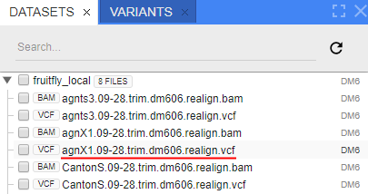

Tap "MANAGE PERMISSIONS" in the context menu:

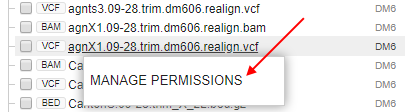

The pop-up window will be appeared:

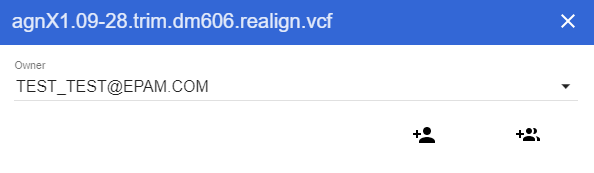

In this window you can change an owner of the object, grant or deny permissions on the object to the users, groups and roles.

## Change an owner

Each object has an additional "Owner" property. Owner property is assigned to the user that created an object.

To change an owner of the object click on owner's name and select from the dropdown list another user (**1**), confirm choice by clicking on  icon opposite the inputted user name (**2**):

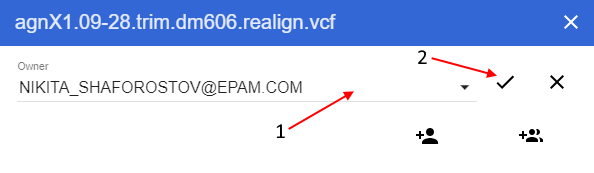

## Edit permissions

### Edit permissions on the object for a specific user
You can explicitly define permissions for the object for a particular user in the "Manage permissions" window:
1. Click on  icon.
2. In appeared window select user in the dropdown list, for whom you'd define permissions (**1**). Confirm your choice by clicking "**Save**" button (**2**):

    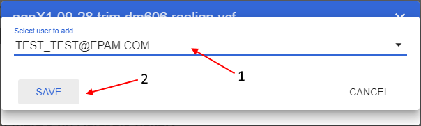

3. In the "Manage permissions" window the table with selected user will be appeared. Click on the user name, the form with the permissions settings for this user will be displayed in the bottom:

    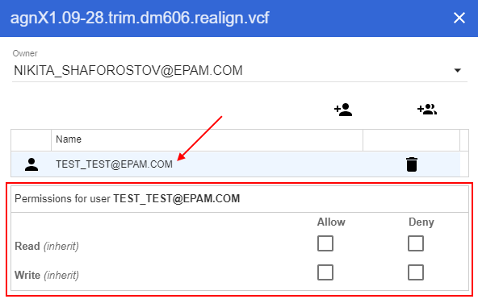

4. Set permissions by ticking checkboxes. E.g. in the example below both permissions ("**Read**" and "**Write**") were granted:

    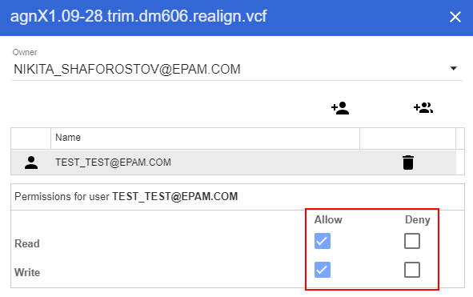

    Set values will be saved automatically.

    > You could do the same through CLI using the command:
    > ```
    > $ ngb chmod rw+ -fl agnX1.09-28.trim.dm606.realign.vcf -u test_test@epam.com
    > ```
    > Set that permissions for a specific dataset (e.g. for the dataset "*fruitfly_local*"):
    > ```
    > $ ngb chmod rw+ -ds fruitfly_local -u test_test@epam.com
    > ```

5. You can unset permissions for the user by unticking checkboxes. Permissions settings will be displayed like:

    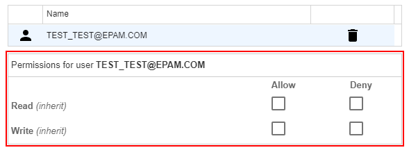
    
    > You could do the same through CLI using the command:
    > ```
    > $ ngb chmod ! -fl agnX1.09-28.trim.dm606.realign.vcf -u test_test@epam.com
    > ```
    > Unset permissions for a specific dataset (e.g. for the dataset "*fruitfly_local*"):
    > ```
    > $ ngb chmod ! -ds fruitfly_local -u test_test@epam.com
    > ```

### Edit permissions on the object for a specific user group/role
You can explicitly define permissions for the object for a particular user group or role in the "Manage permissions" window:
1. Click on  icon:
2. In appeared window select a group/role in the dropdown list, for which you'd define permissions (**1**). Confirm your choice by clicking "**Save**" button (**2**):

    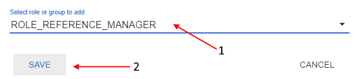

3. In the "Manage permissions" window selected group/role will be appeared in the table. Click the group/role name, the form with the permissions settings for this group/role will be displayed in the bottom:

    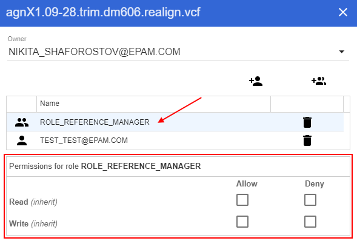

4. Set permissions by ticking checkboxes. E.g. in the example below both permissions ("Read" and "Write") were denied:

    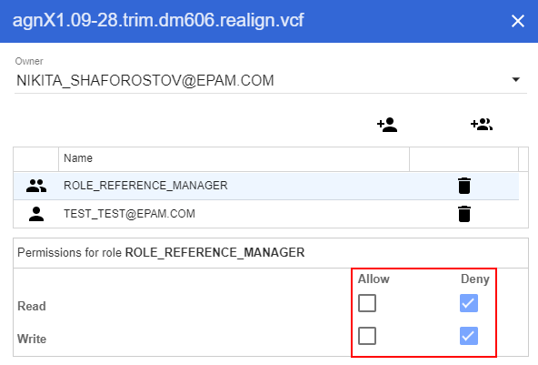

    Set values will be saved automatically.

    > You could do the same through CLI using the command:
    > ```
    > $ ngb chmod rw- -fl agnX1.09-28.trim.dm606.realign.vcf -gr REFERENCE_MANAGER
    > ```
    > Set that permissions for a specific dataset (e.g. for the dataset "*fruitfly_local*"):
    > ```
    > $ ngb chmod rw- -ds fruitfly_local -gr REFERENCE_MANAGER
    > ```

5. You can unset permissions for the group/role by unticking checkboxes. Permissions settings will be displayed like:

    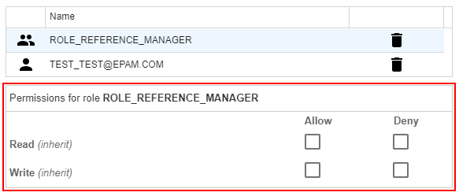
    
    > You could do the same through CLI using the command:
    > ```
    > $ ngb chmod ! -fl agnX1.09-28.trim.dm606.realign.vcf -gr REFERENCE_MANAGER
    > ```
    > Unset permissions for a specific dataset (e.g. for the dataset "*fruitfly_local*"):
    > ```
    > $ ngb chmod ! -ds fruitfly_local -gr REFERENCE_MANAGER
    > ```

## Delete set permissions
To delete set permissions for the object for a particular user, user group or role in the "Manage permissions" window:
1. Click on "**Recycle bin**" icon opposite the user name or user group/role, for which you'd delete set permissions.
2. Changes will be saved automatically.

> You could delete permissions through CLI using the command exactly the same like for "*unset permissions*" (see examples above).