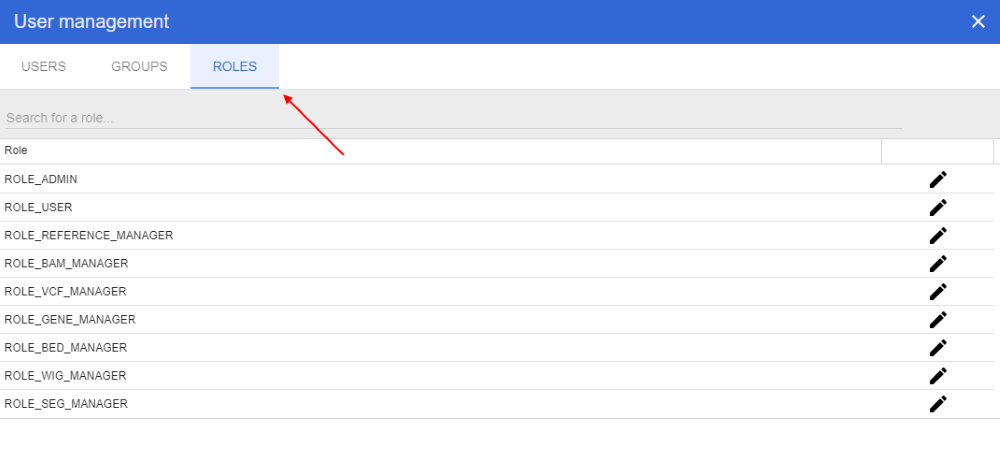
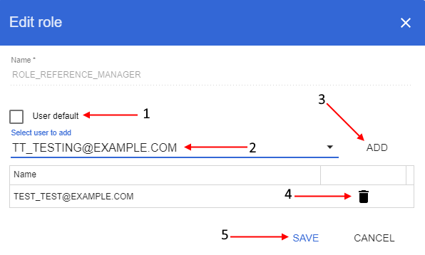

# Roles
> Note: user management panel is available only for the users with the *ADMIN* role.

In the user management panel select "**Roles**" tab:



On this tab you can view the full NGB users' roles list. Here you can grant/refuse roles to the users.

You can search specific role or limit displayed list by typing a role name in the query string in the upper side of the tab.

## Edit role
To edit a role click  icon opposite the role name.

In opened pop-up window: if you want to appoint the role to each new user by default set "**User default**" checkbox (**1**), if you want to grant specific user(s) by this role - select them from the dropdown list (**2**) and click "**Add**" button to confirm (**3**), if you want to deprive specific user(s) of this role click "**Recycle bin**" button opposite the user name (account) (**4**). After all changes have been made click "**Save**" button (**5**) to confirm:



> You also can grant existing users from the example above by the role through CLI using the command:
> ```
> $ ngb add_group {ROLE_NAME} -u tt_testing@example.com,test_test@example.com
> ```