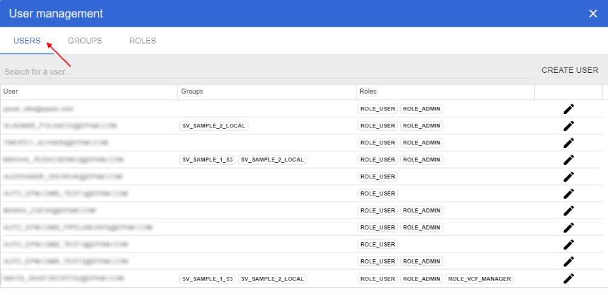
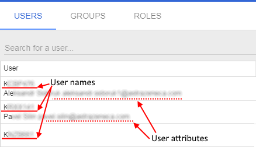
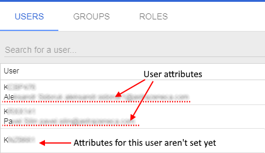
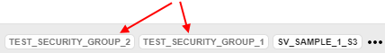
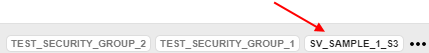
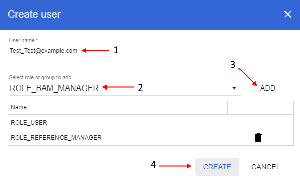
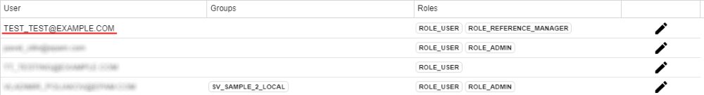
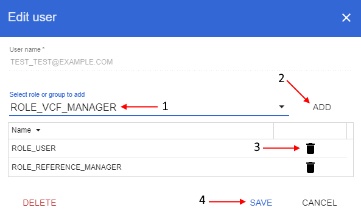
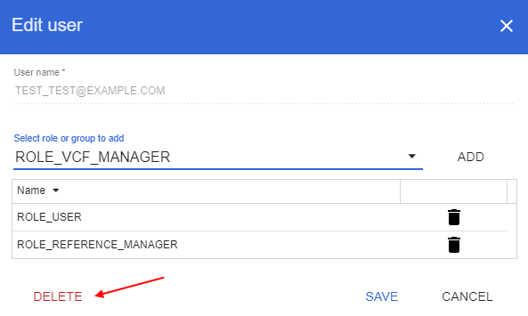
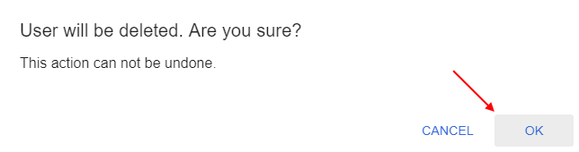

# Users
> Note: user management panel is available only for the users with the *ADMIN* role.

In user management panel select "**Users**" tab:


On this tab you can view the full NGB users list, their groups and roles:
1. Column **User** - displays user names. Under the user name there are user attributes that are set by the authentication system:

    

    These attributes are displayed only after the first user authorization, otherwise only the user name is shown:
    
    

2. Column **Groups** - displays the groups list of the specific user. If this list is large - only first three groups are shown, other groups can be shown when hover over `...` icon. In this list there are two types of groups:
    - *domain groups* that were assigned to the user by the system environment. These groups couldn't be created, deleted, assigned or removed by the users with the *ADMIN* role. But users with the *ADMIN* role can manage permissions on these groups. Domain groups are shown in grey color: 
    - *internal groups* that were created in NGB. Users with the *ADMIN* role can create/delete these groups, assign or remove users from them and manage permissions on them. Internal groups are shown in black color: 
3. Column **Roles** - displays the roles list of the specific user. If this list is large - only first three roles are shown, other roles can be shown when hover over `...` icon.
4. Column with "**Edit**" buttons.

In these tab you can add new user or delete existing, also here you can grant/refuse roles or assign groups (exluding domain groups) to the users.

You can search specific user or limit displayed list by typing user name/user attributes in the query string in the upper side of the tab.

## Add new user
To add new user click "**Create user**" button on the right side of the panel.

In opened pop-up window: input user authentical account into the "**User name**" field (**1**), if you want to assign to user specific role(s) or group(s) select them from the dropdown list (**2**) and click "**Add**" button for confirmation (**3**). Then click "**Create**" button (**4**) to finish adding new user:


> Note: the *USER* role is assigned to all new users by default, you cannot delete it while adding a user.

After that created user will be appeared in the NGB users list:



> You also could create this user through CLI using the command:
> ```
> $ ngb reg_user test_test@example.com --groups REFERENCE_MANAGER
> ```

## Edit user
To edit a user click  icon opposite the user name (account).

In opened pop-up window: assign to the user specific role(s) or group(s) by selecting them from the dropdown list (**1**) and clicking "**Add**" button for confirmation (**2**), delete unnecessary role(s) or group(s) by clicking "**Recycle bin**" icon opposite the role/group name (**3**). After all changes were done click "**Save**" button (**4**) to confirm:



> You also could assign this user to the existing group/role from the example above through CLI using the command:
> ```
> $ ngb add_group VCF_MANAGER -u test_test@example.com
> ```

## Delete user
To delete a user click  icon opposite the user name (account).

In opened pop-up window: click "**Delete**" button in the left downer corner:



Then confirm deleting in appeared window by clicking "**Ok**" button:



> You also could delete that user through CLI using the command:
> ```
> $ ngb del_user test_test@example.com
> ```