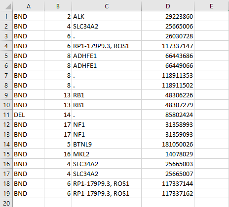
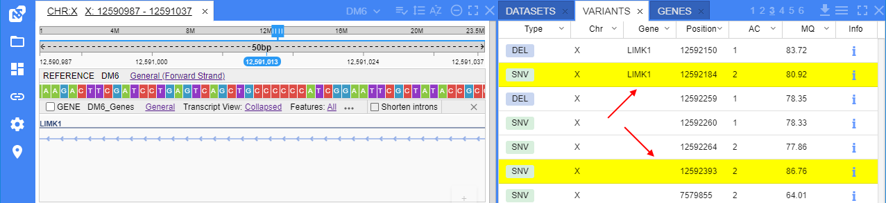
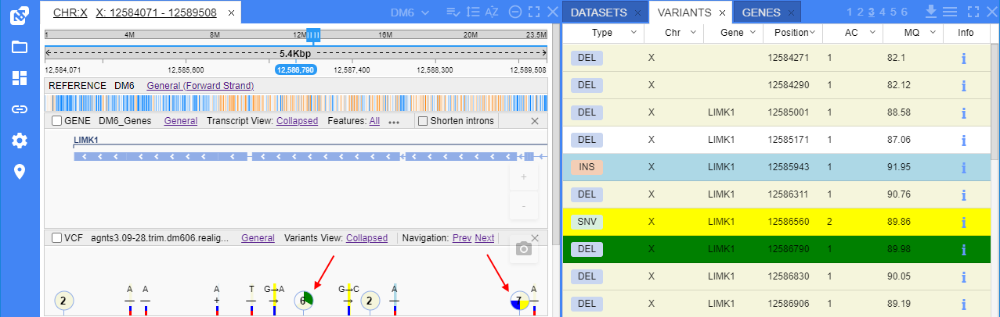

# Variants

- [Viewing variation annotation](#viewing-variation-annotation)
- [Filters](#filters-for-variants-panel)
- [Download the variants table data](#download-the-variants-table-data)
- [Highlight variants of interest](#highlight-variants-of-interest)

**Variants** panel is used to show the list of variants loaded from the project's VCF files in a tabular view.  
  

To navigate to a variant, click the variant's row in the table. This variant will be opened in the "**Browser**" panel, at the corressponding VCF track.

## Viewing variation annotation

When you click a variation at the VCF track, a popup with the results of a DNA rearrangement appears.
There are two types of visualization:

- **SNP and small indels** - shows variations on an exons-introns structure, aminoacids on REF/ALT sequences  
  
- **Structural variations** -  shows large chromosome rearangements. A specific visualization is used for each SV type:
    - **INV**  
    
    - **BND**  
    
    - **DEL**  
    
    - **DUP**  
    

If `UNIPROT` contains information on protein domains for a gene involved in a variation, these will be visualized as colors on genes.  
By default, breakpoints of an SV would be highlighted with a red line, indicating the places where the genes fused. To toggle this functionality, (un)tick the Highlight breakpoints checkbox on the **VISUALIZER** tab.  
  

## Filters for variants panel

**Filters** are used to filter variants displayed in the **Variants** panel. You can use one or more parameters to filter variants.  
To open them - click the _hamburger_ icon and select the "**Show filters**" item in the list:  
  

Filter fields will appear under the column headers:  
  

Changing one or more filtering parameters triggers the refreshing of the **Variants** panel:  
    
  

To reset the filter(s):

- for the certain column, click the arrow icon at the column header and select the "**Clear column filter**" item (see **1** at the picture below)
- for all columns simultaneously, click the _trash bin_ icon in the **Variants** panel header (see **2** at the picture below)  
  

To hide the filters row - click the _hamburger_ icon in the **Variants** panel header and unset the "**Show filters**" item.

## Download the variants table data

To download the data displayed in the **Variants** table - click the _download_ icon in the panel header:  
    
The pop-up will appear:  
  

Here:

- select the format for the downloading table data (CSV or TSV, _CSV by default_)
- set the checkbox if the the header should be included to the downloading file (_header is not included by default_)

Once the setup is finished, click the **Download** button. Table will be downloaded automatically:  
  

The downloaded table will contain only the same data that was displayed in the **Variants** table before the download (considering all filters and sortings):  
  

## Highlight variants of interest

VCF files may include a large number of variants and it could be helpful to highlight variants of interest based on values of the panel fields (variant attributes).

System admin can create/edit the special JSON-file (`interest_profiles.json` in the NGB config directory) where a list of condition profiles is described.  
Each profile in that file contains an own set of conditions based on the variant attributes. For a condition, the color is being specified.  
At the GUI, user can select any profile from the described file and:

- in the variants table, if the variant is satisfy to the certain condition of the profile - variant row is being highlighted in that condition color
- at the VCF track, if the variant is satisfy to the certain condition of the profile - this variant is being highlighted in that condition color

The format of the JSON-file with condition profiles is the following:

``` json
{
  "<profile_name1>" : {
    "is_default" : "<is_default_value>",
    "conditions" : [
      {
        "condition" : "<condition_set1>",
        "highlight_color" : "<highlight_color1>"
      },
      {
        "condition" : "<condition_set2>",
        "highlight_color" : "<highlight_color2>"
      },
      ...
    ]
  },
  "<profile_name2>" : {
    "conditions" : [ ... ]
  },
  ...
}
```

> Where:
>
> - `<profile_name>` - a profile name
> - "**is_default**" (_boolean_, _not-required_) - key for specifying whether the current profile is default one. If several profiles are marked as "default" profile (have `"is_default" : "true"`) - only first of them becomes "default" profile, other are ignored
> - "**conditions**" - an array of condition sets. For each set, conditions are being specified for variants' matching check and the color in which these variants will be highlighted:  
>     - "**condition**" - a condition set. May include one or several conditions for VCF info fields which values may be of interest (for which the conditions are being specified and comparisons will be performed). If the condition set is not specified - no variants will be highlighted in the corresponding color
>     - "**highlight_color**" - key for specifying a color. The variants matched the conditions of the current set will be highlighted in the GUI in this color (color should be specified in HEX)
>
> Each `<condition_set>` should have a structure: `(<id1> <comparison_operator1> <value1>) <logic_operator1> (<id2> <comparison_operator2> <value2>) ...`  
> Where:
>
> - `<id>` (_string_) - VCF info field ID. Should be specified in quotes (examples: `'ac'`, `"mp"`, `'excess het'`)
> - `<comparison_operator>` - operator that will be used for the comparison of the VCF info field value with the specified in the current condition. Possible values:
>     - `==` - **equals** - for string, numeric and boolean values
>     - `!=` - **not equals** - for string, numeric and boolean values
>     - `>` - **greater than** - for numeric values
>     - `>=` - **greater than or equal to** - for numeric values
>     - `<` - **less than** - for numeric values
>     - `<=` - **less than or equal to** - for numeric values
>     - `in` - **in** - for arrays
>     - `notin` - **not in** - for arrays
> - `<value>` (_string_) - value with which the comparison is being performed. Should be specified in quotes, arrays should be specified in square brackets (examples: `'2'`, `"true"`, `'[1, 10, 22]'`)
> - `<logic_operator>` - defines how specified comparisons will combinate:
>     - variants of interest should match both comparisons. In this case, `<logic_operator>` should be `and`
>     - variants of interest should match any comparison (at least one). In this case, `<logic_operator>` should be `or`
>
> More complex sets from several comparisons can be specified by rules of Boolean algebra, using additional brackets, e.g.: `((<comparison1>) or (<comparison2>)) and ((<comparison3>) or (<comparison4>))`.

Example of the JSON-file with a single profile:

``` json
{
  "Example conditions" : {
    "is_default" : true,
    "conditions" : [
      {
        "highlight_color" : "ffff00",
        "condition" : "('ac' == '2') and ('mq' >= '80')"
      }
    ]
  }
}
```

By the example above, the default profile was described that has the following properties - variants of interest will be highlighted in color `#FFFF00` (yellow) if they match both conditions: allele count equals `2` and mapping quality greater than or equals to `80`.

By default, the variants highlighting is disabled.  
To enable it and select the certain conditions profile:

1. Click the _gear_ icon in the main menu to open the **Settings**:  
  
2. The settings pop-up will be opened. Select the **VCF** tab:  
  
3. At the **VCF** tab, enable the variants highlighting feature. For that - set the corresponding checkbox:  
  
4. If the checkbox is enabled - the list with condition profiles will appear:  
  
5. Select the desired profile from the list. _In our example, we will use the profile described above - "Example conditions"_:  
    
  Click the **SAVE** button to confirm changes.
6. Once the profile is selected, the variants satisfied to the profile conditions will be highlighted in the condition colors:  
    
  **_Note_**: rows not satisfied the conditions will remain the same (without additional highlighting)
7. If open any of the highlighted variants - it will be highlighted at the VCF-track as well:  
  
8. For the collapsed VCF-tracks, when several variants are merged into a "bubble" and among them there are some variants of interest from different condition sets - such "bubble" is being highlighted in all corresponding colors (like pie chart diagram), e.g.:  
  

> **_Notes_**:
>
> - Conditions profile doesn't consider the dataset (will be automatically applied to any dataset with VCF files).
> - If the same variant matches different condition sets from the profile, it should be highlighted only in a color of the first condition set in the list

To disable the highlighting feature - disable the checkbox in the settings.
