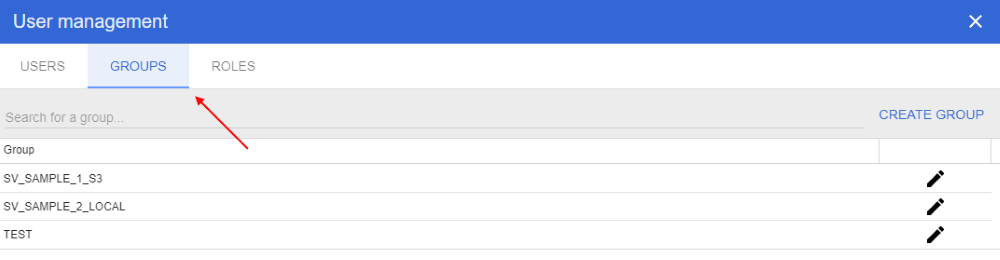
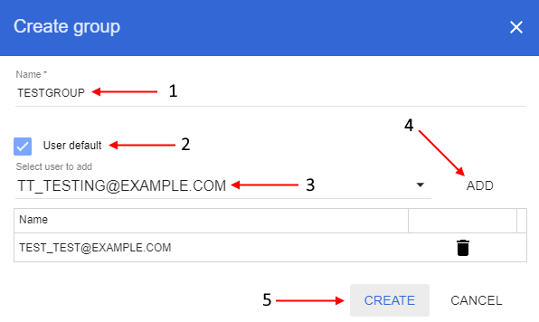
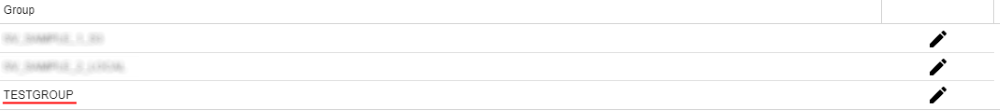
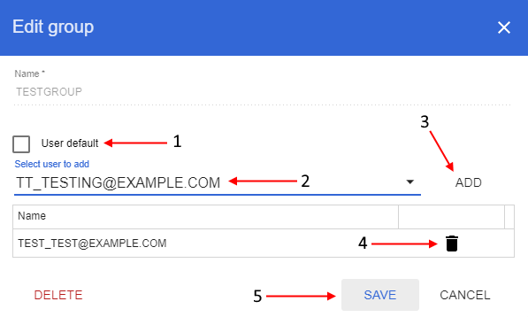
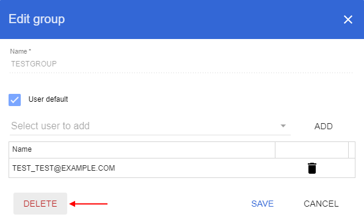
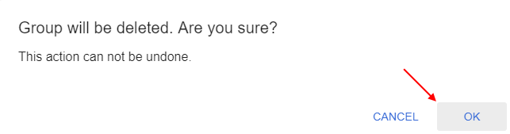

# Groups
> Note: user management panel is available only for users with the *ROLE_ADMIN* role.

In user management panel select "**Groups**" tab:

On this tab you can view the full NGB users groups list. Here you can add a new group or delete existing, also here you can assign groups to users.

You can search specific group or limit displayed list by typing group name in query string in upper side of the tab.

## Add new group
To add new group click "**Create group**" button on the right side of the panel.

In opened pop-up window: input group name into the "**Name**" field (**1**), if you want to appoint the creating group to every new user by default set "**User default**" checkbox (**2**), if you want to assign specific user(s) to the creating group - select them from dropdown list (**3**) and click "**Add**" button for confirmation (**4**). Then click "**Create**" button (**5**) to finish adding new group:

After that created group will be appeared in the NGB groups list:

## Edit group
To edit a group click  icon opposite the group name.

In opened pop-up window: if you want to appoint the group to every new user by default set "**User default**" checkbox (**1**), if you want to to assign specific user(s) to the group - select them from dropdown list (**2**) and click "**Add**" button for confirmation (**3**), if you want to exclude specific user(s) from the group click "**Recycle bin**" button opposite user name (account) (**4**). After all changes were done click "**Save**" button (**5**) to confirm:

## Delete group
To delete a group click  icon opposite the group name.

In opened pop-up window: click "**Delete**" button in left downer corner:

Then confirm deleting in appeared window by click "**Ok**" button to confirm:
