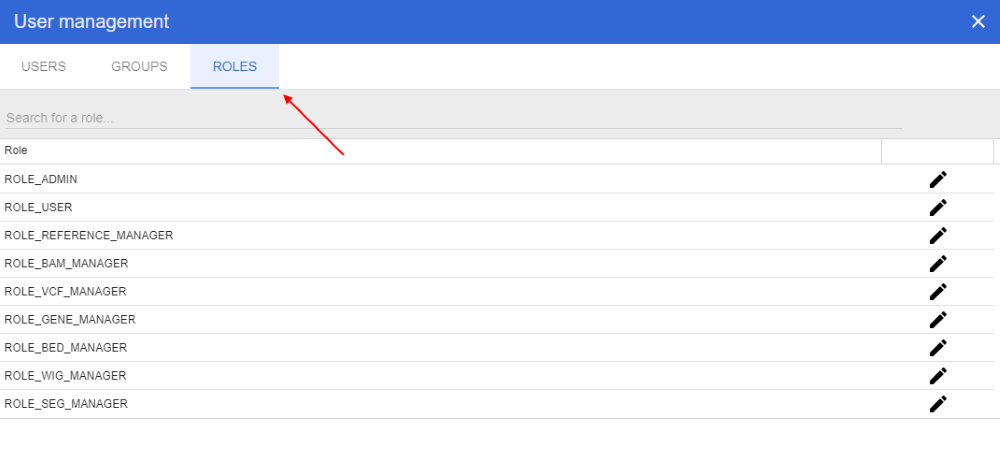
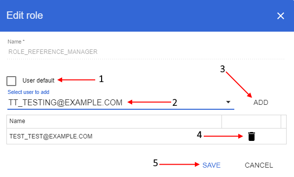

# Roles
> Note: user management panel is available only for users with the *ROLE_ADMIN* role.

In user management panel select "**Roles**" tab:

On this tab you can view the full NGB users roles list. Here you can grant/refuse roles to users.

You can search specific role or limit displayed list by typing role name in query string in upper side of the tab.

## Edit role
To edit a role click  icon opposite the role name.

In opened pop-up window: if you want to appoint the role to every new user by default set "**User default**" checkbox (**1**), if you want to grant specific user(s) by this role - select them from dropdown list (**2**) and click "**Add**" button for confirmation (**3**), if you want to deprive specific user(s) of this role click "**Recycle bin**" button opposite user name (account) (**4**). After all changes were done click "**Save**" button (**5**) to confirm:
